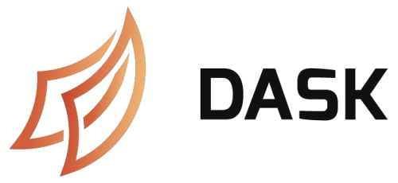

 

# Supported tags and respective Dockerfile links

 - [2021.1.9]

# What is Dask ? 

[Dask]() is a flexible library for parallel computing in Python. Dask is composed of two parts:
 - Dynamic task scheduling optimized for computation. This is similar to Airflow, Luigi, Celery, or Make, but optimized for interactive computational workloads.
 - Big Data collections like parallel arrays, dataframes, and lists that extend common interfaces like NumPy, Pandas, or Python iterators to larger-than-memory or distributed environments. These parallel collections run on top of dynamic task schedulers.

# How to use this image

## Start Dask scheduler instance

    $ docker run -d --name=some-scheduler image:tag dask-scheduler

Where:

 - `some-scheduler` is name you want to assign to your container
 - `image` is Docker image name
 - `tag` is Docker image version

## Start Dask worker instance

    $ docker run -d --name=some-worker image:tag dask-worker some-scheduler:8786

Where:

 - `some-worker` is name you want to assign to your container
 - `some-scheduler:8786` is scheduler endpoint at which worker will connect
 - `image` is Docker image name
 - `tag` is Docker image version

**NOTE** It is recommended to mount one shared directory for workers because all workers must have access to external files you use (e.g reading csv file into dask dataframe).

## Environment variables

**EXTRA_APT_PACKAGES**

This is *optional* variable. It specifes extra apt packages that you want to install. Example

    $ -e EXTRA_APT_PACKAGES="vim nano"

**EXTRA_PIP_PACKAGES**

This is *optional* variable. It specifes extra pip packages that you want to install. Example

    $ -e EXTRA_APT_PACKAGES="shapely datetime"

**TZ**

This is *optional* variable. It specifes timezone. Default value is `Europe/Zagreb`.

# License

